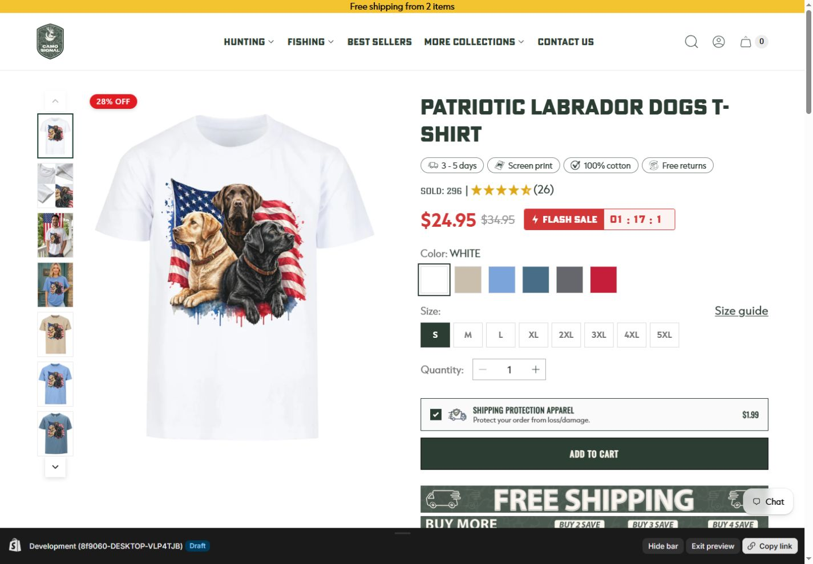
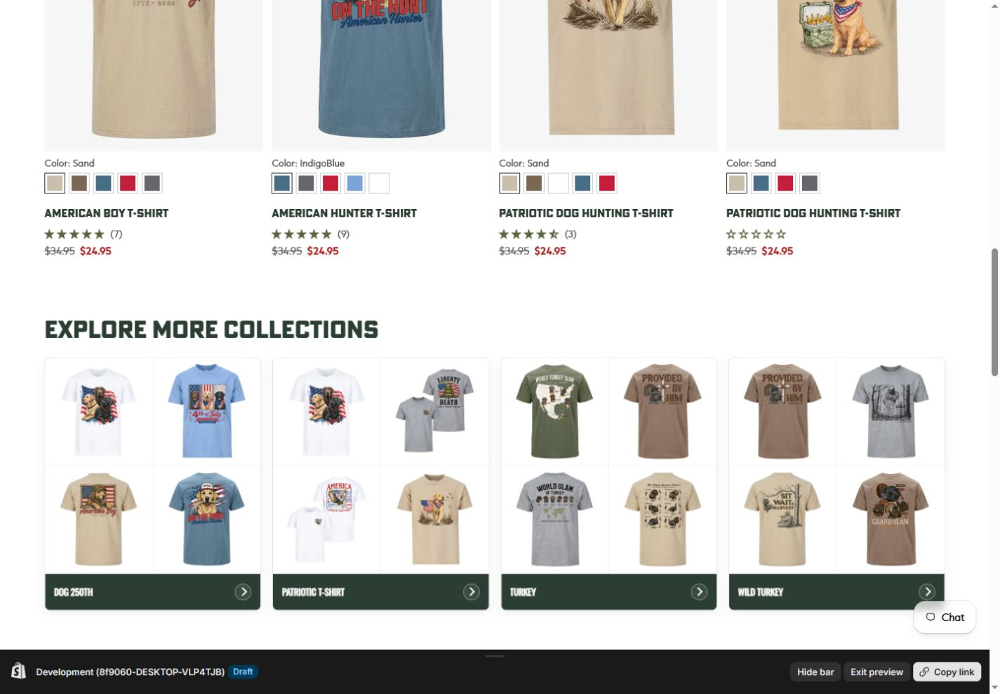
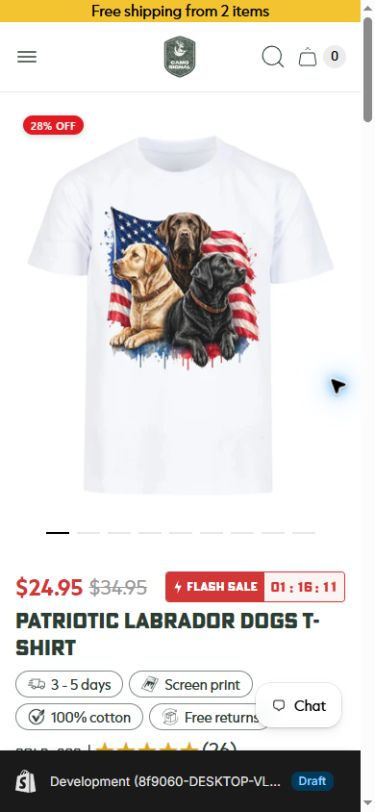
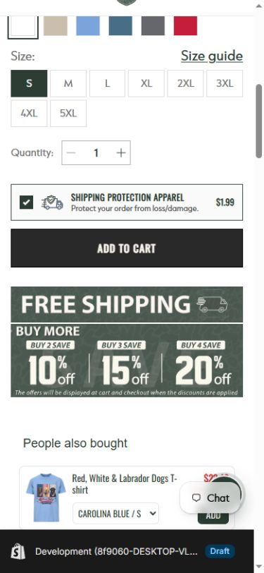

# Đánh giá thẩm mỹ product page

Phạm vi: chỉ đánh giá phần nhìn của product page draft `Patriotic Labrador Dogs T-shirt` trên desktop và mobile; không đánh giá code, UX hay accessibility.

## Kết luận nhanh

Tổng thể: **7/10**. Trang có bản sắc outdoor rõ, ảnh sản phẩm nổi bật và màu xanh rừng dùng khá chắc tay. Điểm trừ chính là quá nhiều tín hiệu bán hàng cùng xuất hiện, khiến phần mua hàng nghiêng về cảm giác “sales page” hơn là một trang thương hiệu cao cấp.

## Các màn hình

1. **Desktop — phần đầu trang: Khá tốt (7.5/10).** Bố cục hai cột cân, ảnh sản phẩm lớn, khoảng trắng tốt và CTA rõ. Tuy vậy, tiêu đề bị ngắt dòng hơi cứng; badge lợi ích, đánh giá, giá sale, flash sale, protection và banner khuyến mãi cùng tranh sự chú ý.

   

2. **Desktop — sản phẩm liên quan và collection: Tốt (7/10).** Các card collection dùng màu xanh thương hiệu nhất quán, ảnh đủ phong phú và tạo cảm giác catalogue. Phần product card phía trên hơi nhiều swatch, giá và icon nhỏ nên tổng thể vụn.

   

3. **Mobile — phần đầu trang: Khá (6.8/10).** Ảnh áo chiếm ưu thế và header gọn. Giá, flash sale, tên sản phẩm và bốn badge nằm sát nhau làm nhịp thị giác dày; nút chat còn che một phần nội dung.

   

4. **Mobile — vùng mua hàng: Trung bình khá (6.5/10).** Size và CTA rõ, nhưng protection card, CTA, banner free shipping và upsell nối tiếp nhau khiến trang dài và có cảm giác nhiều quảng cáo. Banner khuyến mãi nặng chữ hơn phong cách sạch của phần đầu trang.

   

## Nên chỉnh để đẹp hơn

- Giữ font condensed cho heading, giảm dùng ở label và nội dung nhỏ để trang bớt “gằn”.
- Tinh gọn khu vực mua hàng: chỉ giữ một tín hiệu khuyến mãi nổi bật; đẩy banner “Free Shipping / Buy More” xuống dưới accordion.
- Gom bảng màu về xanh rừng, trắng và một màu sale đỏ; thanh vàng trên cùng hiện hơi tách khỏi hệ màu còn lại.
- Trên mobile, tăng khoảng thở giữa giá, tiêu đề, badge và options; dời nút chat khỏi vùng thông tin sản phẩm.

Thanh preview Shopify trong ảnh không thuộc thiết kế storefront và không được tính vào điểm.
